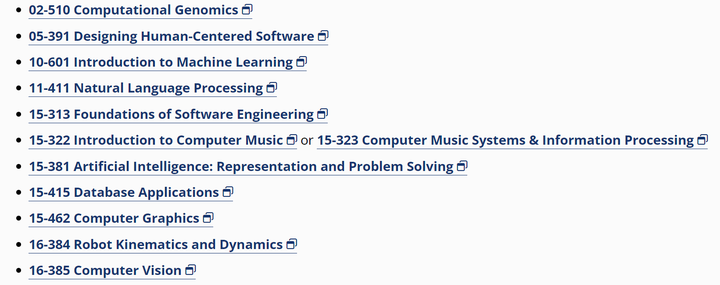

# 计算机专业怎样才能进大厂？

# question：  
0基础计算机，大学四年如何规划进大厂。

 

# answer：  
1.

学习CS61A,B,C

OS:MIT S6801

Network: Stanford CS144

然后选择你的方向

  

上面还未涵盖 [并行计算](https://zhida.zhihu.com/search?content_id=593224359&content_type=Answer&match_order=1&q=%E5%B9%B6%E8%A1%8C%E8%AE%A1%E7%AE%97&zhida_source=entity)和分布式系统以及网络安全有兴趣也可以学习

2.

关注大厂的暑期训练营

3.

海投简历,面试,复盘

以上不会的地方都可以问chatGPT.

另外,你得想清楚

你想去去大厂的主要原因是什么

 赞同数：赞同 5，评论数：添加评论
 

[https://www.zhihu.com/question/608326567/answer/3097267425](https://www.zhihu.com/question/608326567/answer/3097267425) 

Created: 2023-06-30 13_04・IP 属地四川
Modified: 2023-06-30T05_04_06_000Z
