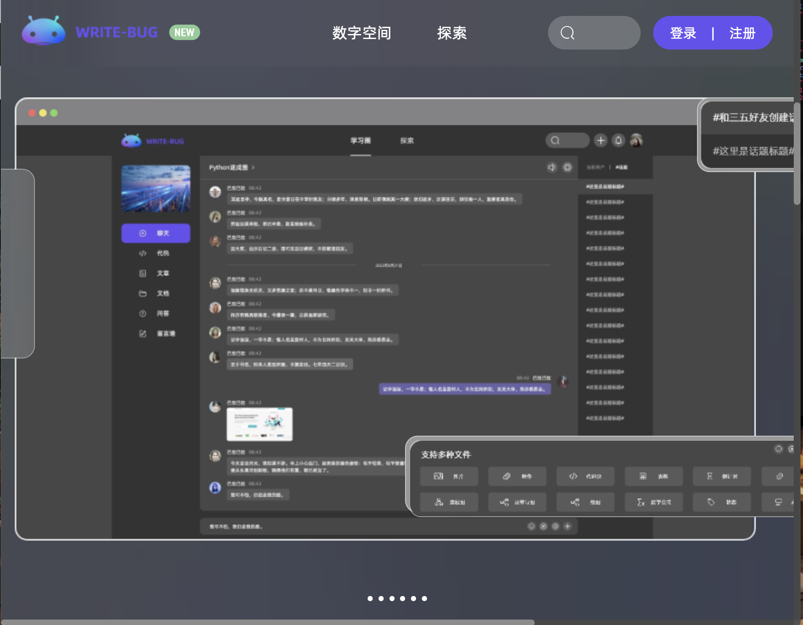

# 我想开始自己博客记录，自己是计算机专业的，应该怎么开始呢？

# question：  
目前就读于某不知名大学 计算机科学与技术专业。一开始用的是iPad做笔记，后来接触了markdown语法的一些编辑器，最近使用的是语雀，但是体验一般。社交功能匮乏，最近看到writebug这一个网页，好像刚刚开始内测 有没有老哥有邀请码拉我一手？
还有就是计算机专业的写博客的话要怎么开始，注重着手哪方面的内容？

  

 

# answer：  
github pages . 和 

[jekyll](https://zhida.zhihu.com/search?content_id=597752232&content_type=Answer&match_order=1&q=jekyll&zhida_source=entity) 搭配minimal mistake 主题

 赞同数：赞同 2，评论数：添加评论
 

[https://www.zhihu.com/question/608935985/answer/3122172763](https://www.zhihu.com/question/608935985/answer/3122172763) 

Created: 2023-07-17 11_10・IP 属地四川
Modified: 2023-07-17T03_10_22_000Z
